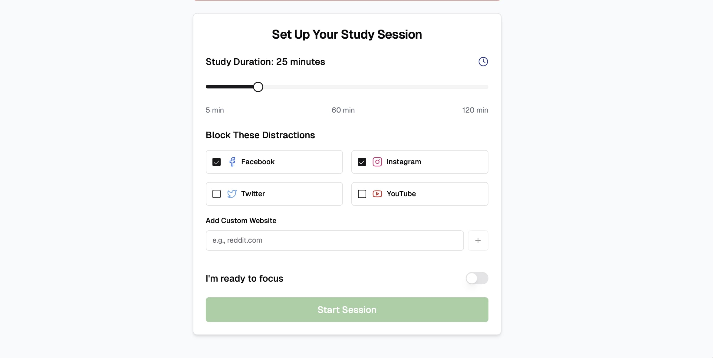
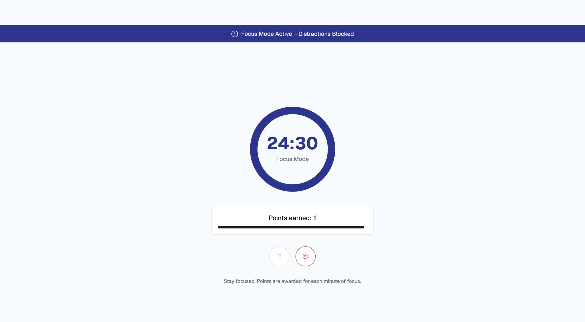
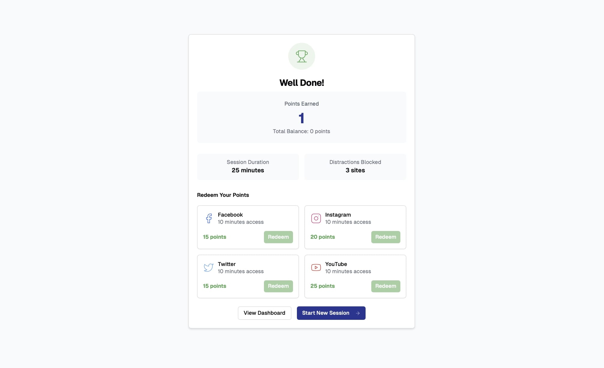

# 🚀 Focus-Verse: Focus Rewards Blocker 🏆

  
  

  
  

## ✨ Overview

Distractions are the nemesis of productivity, especially during crucial study sessions. **Focus-Verse: Focus Rewards Blocker** is a Chrome extension meticulously crafted to combat this. Seamlessly integrating with the Focus Rewards web application, this extension empowers you to block distracting websites, fostering a focused and productive environment. Say goodbye to digital temptations and hello to enhanced concentration!

## 🌟 Key Features

- 🚫 **Effortless Blocking:** Blocks user-defined websites at the onset of your focus sessions.
- ✅ **Automatic Unblocking:** Websites magically reappear once your dedicated focus time concludes.
- 🚧 **Friendly Interruption:** Presents a clean and informative "blocked" page, keeping you aware of your ongoing session.
- 🤝 **Web App Integration:** Communicates fluidly with the Focus Rewards web application for a cohesive experience.

## 🛠️ Installation Guide

Getting started with Focus-Verse is a breeze:

1. 🌐 Open your Google Chrome browser and navigate to `chrome://extensions/`.
2. ⚙️ Activate **Developer mode** by toggling the switch in the top-right corner of the page.
3. 📦 Click on the **"Load unpacked"** button located in the top-left corner.
4. 📂 Select the directory containing the files of this Chrome extension.
5. 🎉 The Focus-Verse icon will now grace your browser toolbar, ready for action!

## 🚀 Usage Instructions

To harness the full power of Focus-Verse, pair it with the Focus Rewards web application:

1. 🔗 Visit the Focus Rewards web app at either the development link: [http://localhost:3000](http://localhost:3000) or the deployed version (if available).
2. 📝 Configure your focus session within the web app, specifying the websites you wish to block during this time.
3. ▶️ Initiate your focus session.
4. 🛡️ The Focus-Verse extension will now diligently block the selected websites for the entire duration of your session, helping you stay on track.

##  Contextual Background 📜

This Chrome extension is a proud creation born out of the **Summer of CodeFest'25** hackathon, organized and championed by the **GSoC Innovators Club**. It directly addresses the pervasive issue of digital distractions that often hinder effective learning and work, providing a tangible solution to cultivate better focus habits.

## 🔗 Explore the Simpler Version

For a more basic iteration of this extension, you can find the repository here: [https://github.com/your-username/focus-rewards](https://github.com/your-username/focus-rewards)

## ⚙️ Core Components

Delve into the heart of the extension:

- `background.js`: The diligent service worker orchestrating the website blocking and unblocking logic.
- `content-script.js`: The vital bridge facilitating communication between the Focus Rewards web application and the extension.
- `blocked.html`: The user-friendly page displayed when a blocked website is encountered, providing session context.
- `popup.html`: The intuitive interface accessible via the extension icon in your browser toolbar.

## 📄 License

This project operates under the **MIT License**. For comprehensive details, please refer to the [LICENSE](LICENSE) file within the repository.

---

**Once you provide the links or image files for the two screenshots, I will update the `[LINK_TO_SCREENSHOT_1]` and `[LINK_TO_SCREENSHOT_2]` placeholders with the correct information.** This will create a visually appealing and professional README for your project.
